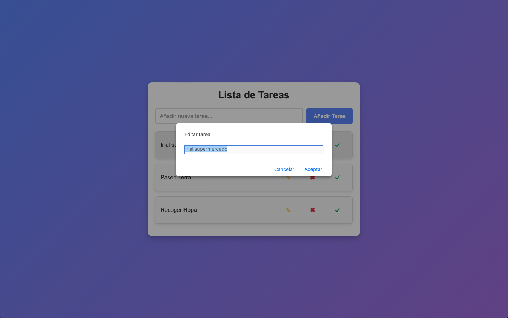

# LISTA DE TAREAS

Esta es una simple aplicación de lista de tareas que permite añadir, editar, eliminar y marcar tareas como completadas. Es una herramienta útil para gestionar tus tareas diarias de manera eficiente.

## Características

- **Añadir tareas**: Introduce una nueva tarea en el campo de texto y haz clic en "Añadir Tarea" o presiona Enter.
- **Editar tareas**: Cambia el texto de una tarea existente.
- **Eliminar tareas**: Elimina cualquier tarea de la lista.
- **Marcar tareas como completadas**: Marca una tarea como completada para resaltar su estado.

## Captura de Pantalla

## Enlace a la Demo

Puedes probar la aplicación en el siguiente enlace: [Demo de Lista de Tareas](https://estip13.github.io/notes-app/)

## Instalación

1. **Clona el repositorio**:
   git clone https://github.com/tu-usuario/notes-app.git

2. **Navega a la carpeta del proyecto**:
   cd notes-app

3. **Abre `index.html`** en tu navegador para usar la aplicación.

## Uso

1. **Añadir tareas**: Escribe una tarea en el campo de texto y haz clic en "Añadir Tarea" o presiona Enter.
2. **Editar tareas**: Haz clic en el botón de lápiz al lado de una tarea para editarla.
3. **Eliminar tareas**: Haz clic en el botón de cruz al lado de una tarea para eliminarla.
4. **Marcar tareas como completadas**: Haz clic en el botón de marca de verificación al lado de una tarea para marcarla como completada.
